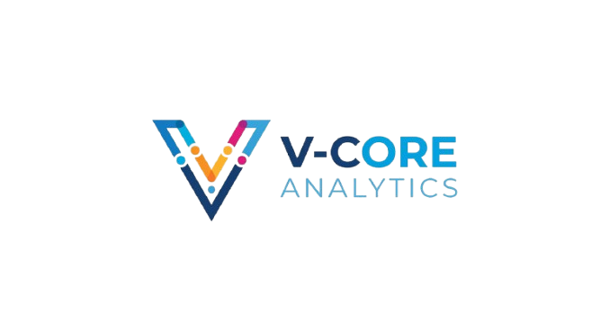

# 📋 V-Core Analytics: Data Engineering & Analytics

## 👥 Equipo técnico
- **Lourdes M.**:  Scrum Master
- **Jesi G.**: Analista
- **Natalia I.**: Analista
- **Fabi H**.: Analista
- **Milena A.**: Analista

## 📋 Descripción del Proyecto
Este proyecto consiste en un análisis exploratorio de datos (EDA) profundo sobre el dataset de Recursos Humanos de **ABC Corporation**. El objetivo principal es identificar los patrones críticos que llevan a los empleados a abandonar la empresa y proponer soluciones estratégicas basadas en datos.

## 🛠️ Tecnologías y Herramientas
* **Lenguaje:** Python
* **Librerías principales:** 
    * `Pandas` para manipulación de datos.
    * `Matplotlib` y `Seaborn` para visualizaciones avanzadas.
    * `Scikit-learn (KNNImputer)` para la gestión de valores nulos.
* **Entorno:** Jupyter Notebook / Google Colab.

## 🧼 Limpieza y Procesamiento de Datos (Data Wrangling)
Uno de los puntos fuertes de este proyecto es el tratamiento riguroso de la calidad de los datos:

1. **Gestión de Nulos Avanzada:** - Uso de **KNN Imputer** para variables sensibles como `Age`, `MonthlyIncome` y `JobSatisfaction`.
   - Imputación por mediana en `YearsWithCurrManager`.
   - Categorización de desconocidos y validación con el cliente para `BusinessTravel`.
2. **Auditoría de Datos:** Eliminación de métricas financieras desactualizadas (`DailyRate`, `HourlyRate`) y eliminación de registros incoherentes mediante filtros lógicos.
3. **Optimización:** Eliminación de variables constantes (`Over18`, `StandardHours`) que no aportaban valor predictivo.

## 📈 Insights Principales (Hallazgos)

* **💰 El Factor Salarial:** El **70% de las fugas** de talento se concentran en el rango salarial inferior a **5k**.
* **🤝 Crisis de Liderazgo:** Se detectó un desplome masivo en la satisfacción laboral al cumplir **5 años** bajo el mismo supervisor.
* **⚠️ Departamentos Críticos:** El área de **Ventas (Sales)** presenta una rotación del 37%, muy superior a su peso proporcional en la empresa.

## 💡 Conclusiones y Recomendaciones
1. **Revisión Salarial:** Ajustar bandas en niveles de entrada y técnicos.
2. **Rotación de Líderes:** Implementar cambios de equipo o manager cada 5 años para evitar el estancamiento.
3. **Planes de Carrera:** Priorizar promociones internas para perfiles con desempeño estable (Rating 3) que llevan más de 2 años sin cambios de rol.

## 📂 Estructura del Repositorio

- 📂 **files/** → Contiene los datasets y recursos visuales.
- 📂 **src/** → Scripts reutilizables y funciones del proyecto.
- 📓 **notebooks** → Análisis exploratorio y generación de insights.
- 📄 **documentation.md** → Documentación técnica del proyecto.
- 📄 **README.md** → Descripción general.

## 👤 Autor

  

